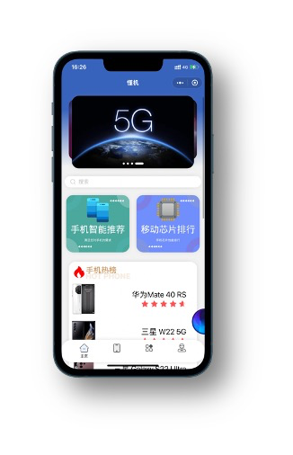
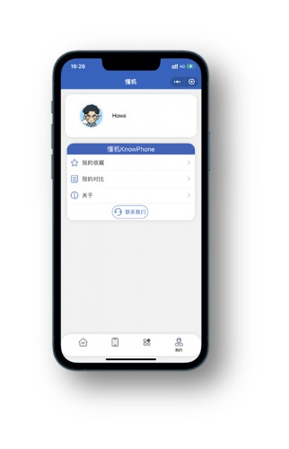
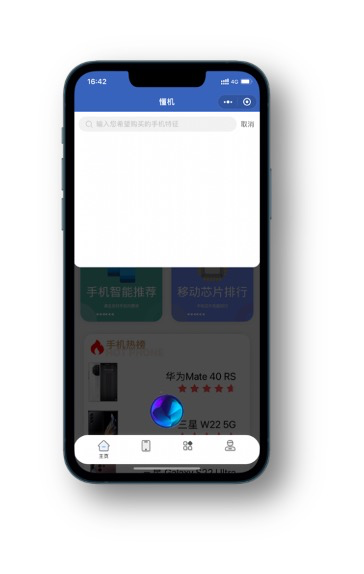
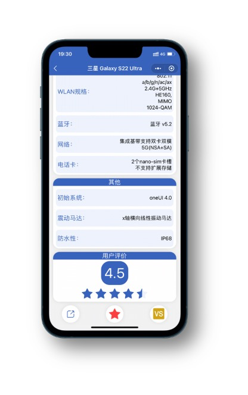
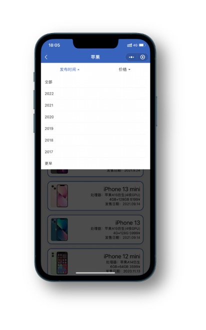
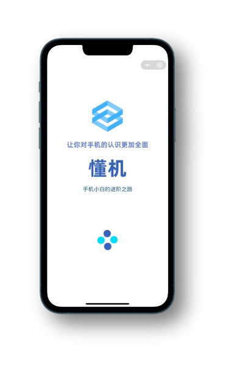
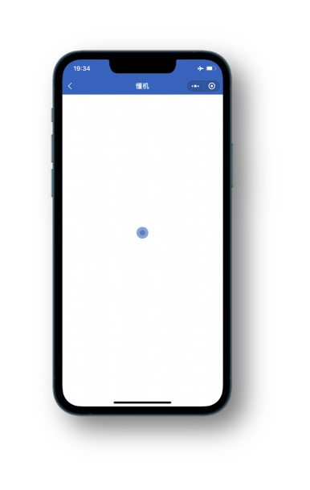

# 懂机 KonwPhone

一个让你对手机的认识更加全面的小程序

详情见[介绍文档](./介绍文档.pdf)

## 部分页面展示

|  |  |  |
| ------------------------------------------------------------ | ------------------------------------------------------------ | ------------------------------------------------------------ |
|  |  |  |
|  |  |  |

## 技术栈

- 微信小程序
- 云开发

## 参考的开源项目

- Vant Weapp-项目地址:https://github.com/youzan/vant-weapp

- Lin UI-项目地址:https://github.com/TaleLin/lin-ui

- WxP UI-项目地址:https://github.com/wxp-ui/wxp-ui

- uCharts-项目地址:https://gitee.com/uCharts/uCharts

- my-swiper-项目地址:https://github.com/lilindog/my-swiper

